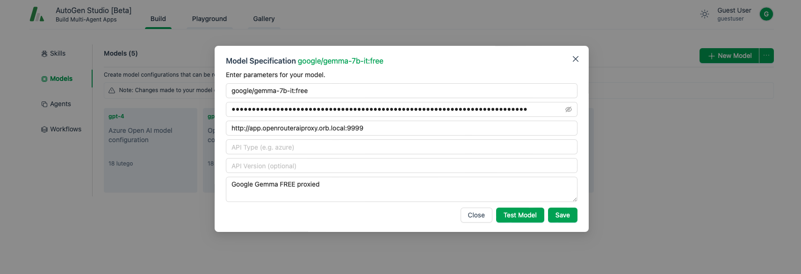

# Openrouter.ai Proxy

## Description

This Python application acts as a proxy server for [openrouter.ai](https://openrouter.ai), facilitating the forwarding of incoming HTTP requests to a specified API URL and managing the responses. Notably, it incorporates a feature enabling the automatic switching to alternative models in response to a 429 error, effectively bypassing rate limits and enabling the utilization of free-of-charge models for programming and testing purposes without incurring any expenses.

## Installation

To install the application using Poetry, use the following steps:

1. Make sure Poetry is installed on your system. If not, you can install it using the instructions from [Poetry's official documentation](https://python-poetry.org/docs/).
2. Create a `.env` file in the root directory of the application. You can use the provided `env-example` file as a template.
3. Update the environment variables in the `.env` file with the necessary configuration for your environment, including the API_URL, REFERER, TITLE, and other relevant settings.
4. Navigate to the directory containing the `pyproject.toml` file.
5. Run the following command to install the application and its dependencies:

```bash
poetry install --no-root --only main
```

## Docker Integration

This application can also be run using Docker, which can simplify the setup process and ensure consistent execution across different environments. Here are the steps to run the application using Docker:

1. Make sure Docker is installed on your system.
If not, you can install it using the instructions from Docker's [official documentation](https://docs.docker.com/install/).

2. Run the Docker Compose Stack for the application by running the following command in the directory containing the docker-compose.yml file:

```bash
docker compose up -d --build
```

## Usage

To use the application, simply run docker compose and set BASE URL of free openrouter model in Base URL field or environment variable like that:

```bash
http(s)://[IP ADDRESS or domain.tld or localhost]:[PORT or 9999]
```

Here is an example for the AutoGen Studio model where proxy is running on OrbStack on localhost:



## TODO

<input type="checkbox">&nbsp;&nbsp; Authorization via Bearer Token</input>

<input type="checkbox">&nbsp;&nbsp; Logging</input>

<input type="checkbox">&nbsp;&nbsp; Statistics</input>

<input type="checkbox">&nbsp;&nbsp; Multiuser</input>

<input type="checkbox">&nbsp;&nbsp; UI</input>
